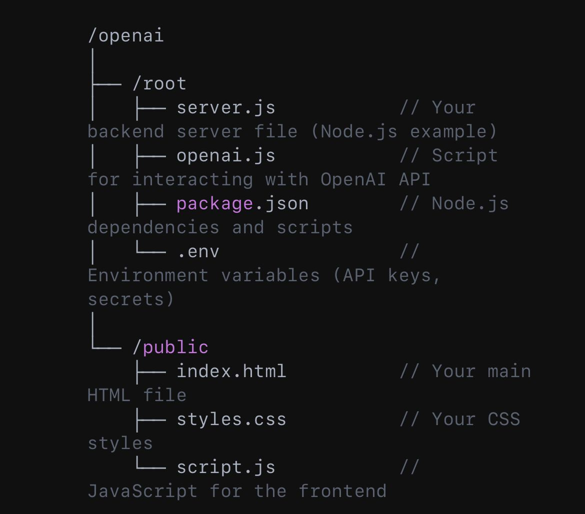

# OpenAI API Integration

## Overview
This repository contains a structured implementation for integrating with the OpenAI API. It serves as a template for developers looking to utilize OpenAI's capabilities in their applications.

